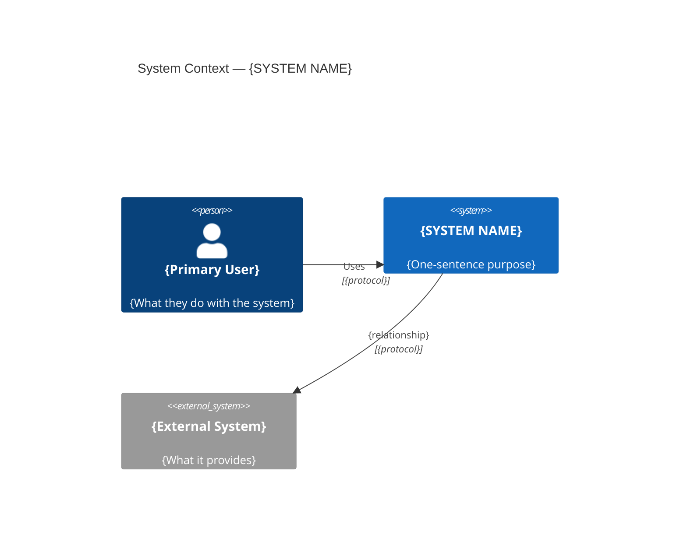
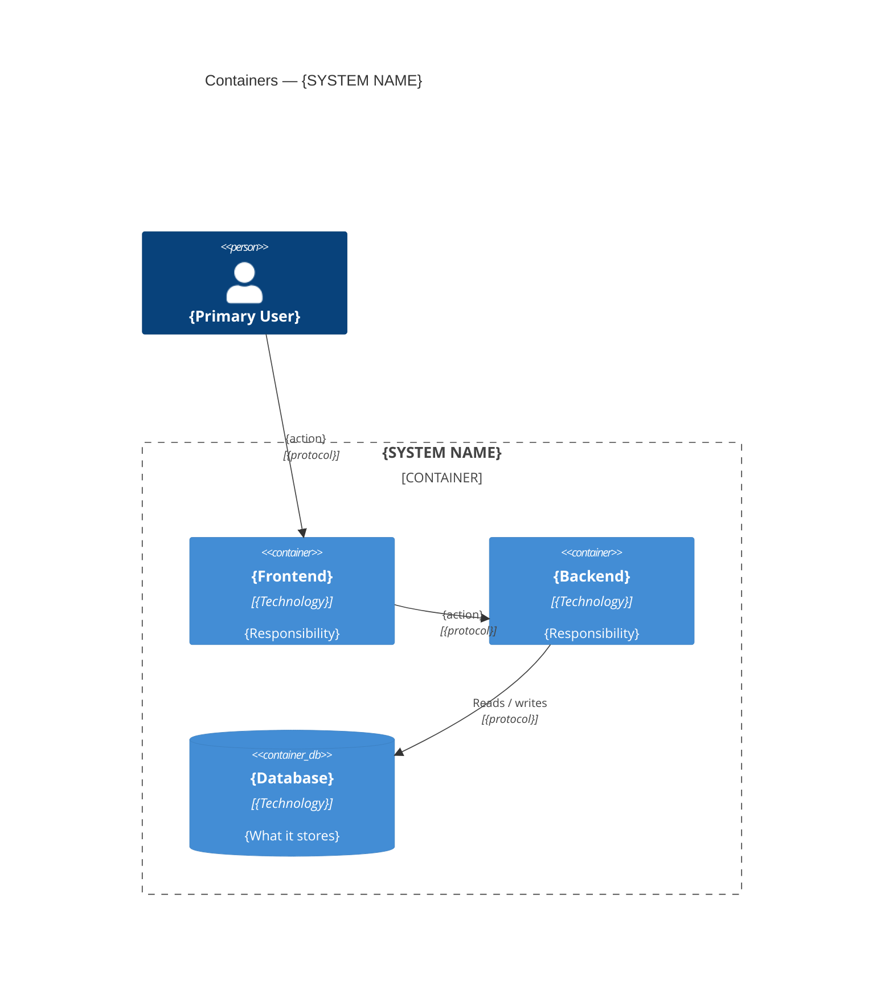
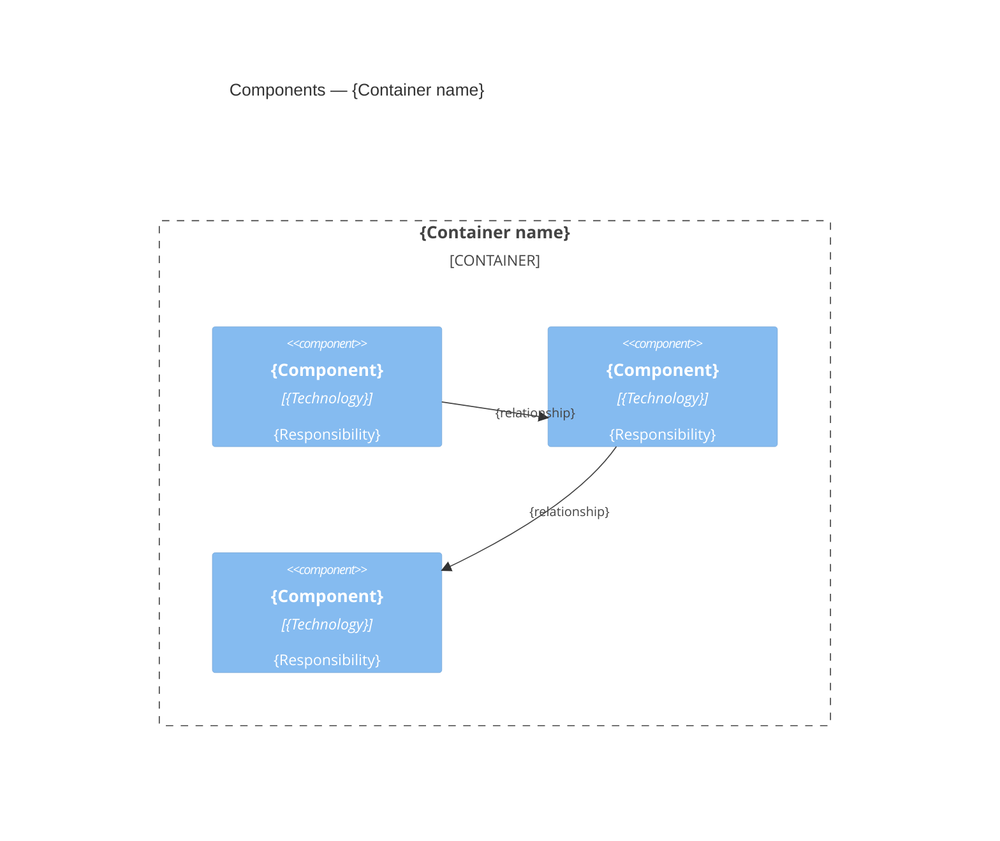
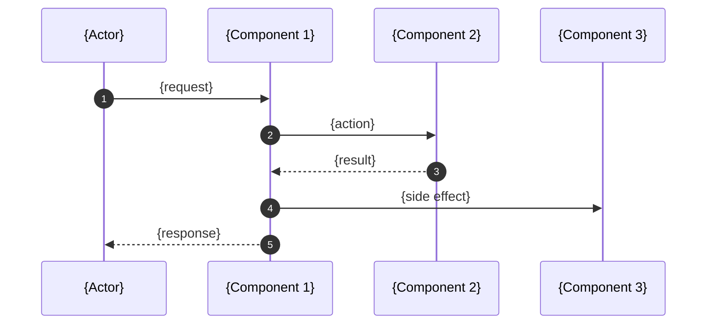
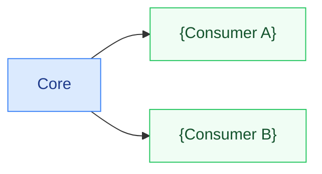

# Architecture — {SYSTEM NAME}

> Template based on the [C4 model](https://c4model.com) (Simon Brown).
> Sections 1–3 follow Context → Container → Component.
> Delete sections that do not apply. Replace all `{...}` placeholders.

---

## 1. System context

Who uses the system and what external systems or infrastructure it depends on.



---

## 2. Containers

The running processes and the protocols between them.



---

## 3. Components

Internal building blocks of `{the primary container}`.



---

## 4. Key flow

The most important runtime sequence — replace with the flow that matters most for this system.



---

## 5. Package / directory structure

```text
{project-root}/
  src/
    {module-a}/     {responsibility}
    {module-b}/     {responsibility}
  config/
    {config-file}
  infra/
    {service}/
  tests/
    fixtures/
```

---

## 6. Dependency rules



Forbidden imports:

```
{Module A}  ──✕──▶  {Module B}
{Module C}  ──✕──▶  {Module D}
```

---

## 7. Quality attributes

| Attribute | Mechanism |
|-----------|-----------|
| **{Attribute}** | {How the architecture achieves it} |
| **{Attribute}** | {How the architecture achieves it} |
| **{Attribute}** | {How the architecture achieves it} |

> Derive attributes from the system's top risks and stakeholder concerns.
> Common candidates: extensibility, reproducibility, isolation, observability,
> security, performance, local-first operation.

---

## 8. Ports and interfaces

| Service / Component | Port / Interface | Notes |
|---------------------|-----------------|-------|
| {Service} | {port} | {protocol, TLS, etc.} |

---

## 9. Architecture decisions

Key decisions are recorded as ADRs in [`docs/adr/`](../adr/):

| ID | Decision |
|----|----------|
| [ADR-001](../adr/001-{slug}.md) | {Decision summary} |
| [ADR-002](../adr/002-{slug}.md) | {Decision summary} |

---

## Usage notes

- **Section 1 (Context)**: one diagram per document — the system as a black box.
- **Section 2 (Containers)**: one box per deployable unit (process, Docker container, mobile app, database).
- **Section 3 (Components)**: one box per significant structural element inside a container. Only diagram containers whose internals are non-obvious.
- **Section 4 (Flow)**: pick the single most important runtime path. Add further `sequenceDiagram` blocks in a `## Flows` section if needed.
- **ADRs**: record *why*, not *what*. The code already shows what was built.
