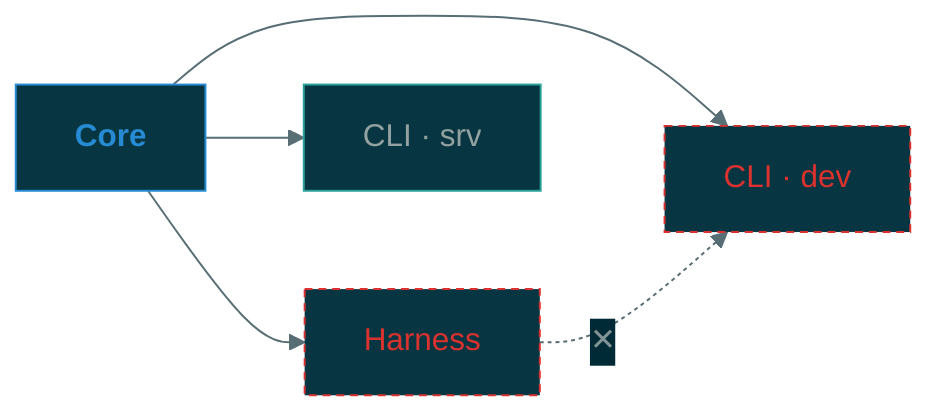
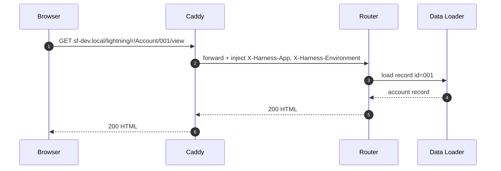

# Mermaid Diagram Style Guide

All Mermaid diagrams across this organisation follow this guide.  
Colors reference [`solarized.md`](solarized.md).

---

## Diagram type selection

| Need | Diagram type |
|------|-------------|
| System / container / component hierarchy | `C4Context` · `C4Container` · `C4Component` |
| Runtime sequence with actors and time | `sequenceDiagram` |
| Dependency or import graph | `graph LR` |
| Process or decision flow | `flowchart TD` |
| State machine | `stateDiagram-v2` |
| Entity relationships | `erDiagram` |

Use the most specific type available. Do not use `flowchart` where `sequenceDiagram` is correct.

---

## Base theme

Set on every diagram that uses custom colors. Uses Mermaid's `base` theme as the reset layer.

```
%%{init: {
  "theme": "base",
  "themeVariables": {
    "background":        "#002b36",
    "mainBkg":           "#073642",
    "primaryColor":      "#073642",
    "primaryBorderColor":"#586e75",
    "primaryTextColor":  "#839496",
    "lineColor":         "#586e75",
    "secondaryColor":    "#002b36",
    "tertiaryColor":     "#002b36",
    "edgeLabelBackground":"#002b36",
    "titleColor":        "#93a1a1",
    "clusterBkg":        "#002b36",
    "clusterBorder":     "#586e75"
  }
}}%%
```

For diagrams embedded in light-mode documentation, swap `background`/`mainBkg` to `#fdf6e3`/`#eee8d5` and text to `#657b83`.

---

## Class definitions

Paste the relevant block at the top of any `graph` or `flowchart` diagram.

```
%% Paste into graph / flowchart diagrams
classDef core     fill:#073642,stroke:#268bd2,color:#268bd2,font-weight:bold
classDef service  fill:#073642,stroke:#2aa198,color:#93a1a1
classDef external fill:#073642,stroke:#b58900,color:#b58900
classDef data     fill:#073642,stroke:#859900,color:#859900
classDef person   fill:#073642,stroke:#6c71c4,color:#6c71c4
classDef error    fill:#073642,stroke:#dc322f,color:#dc322f,stroke-dasharray:4 3
classDef warning  fill:#073642,stroke:#cb4b16,color:#cb4b16
```

### When to use each class

| Class | Solarized accent | Use for |
|-------|-----------------|---------|
| `core` | blue `#268bd2` | Foundation packages; the thing everything else depends on |
| `service` | cyan `#2aa198` | Running processes, containers, deployed services |
| `external` | yellow `#b58900` | Third-party systems, OS resources, infrastructure outside the project |
| `data` | green `#859900` | Databases, file stores, config files, data directories |
| `person` | violet `#6c71c4` | Human actors, user personas |
| `error` | red `#dc322f` | Forbidden paths, error states, rejected conditions |
| `warning` | orange `#cb4b16` | Deprecated flows, caution states |

---

## Node shapes

| Shape | Syntax | Use for |
|-------|--------|---------|
| Rectangle | `id[Label]` | Process, component, package |
| Rounded rectangle | `id(Label)` | Actor, person, soft boundary |
| Diamond | `id{Label}` | Decision point |
| Cylinder | `id[(Label)]` | Database, persistent store |
| Stadium | `id([Label])` | Start / end of flow |
| Subroutine | `id[[Label]]` | Called subprocess |
| Parallelogram | `id[/Label/]` | Input / output |

Do not mix shapes arbitrarily — shape carries semantic meaning.

---

## Edge conventions

| Meaning | Syntax | Rendered as |
|---------|--------|-------------|
| Data or control flow | `A --> B` | Solid arrow |
| Dependency (imports) | `A --> B` | Solid arrow (with `core` class on source) |
| Forbidden / disallowed | `A -.->|✕| B` + `error` class | Dashed red arrow |
| Async / event | `A -.-> B` | Dashed arrow |
| Bidirectional | `A <--> B` | Double-headed arrow |

Label edges when the relationship is not obvious from context:

```
Harness -->|"reads config"| Core
```

Omit labels when the arrow direction and node names make the relationship clear.

---

## Sequence diagrams

```
sequenceDiagram
    autonumber
    participant A as {Actor label}
    participant B as {Component label}

    A->>B: {synchronous call}
    B-->>A: {return}
    A-)B: {async / fire-and-forget}
    Note over A,B: {explanatory note}
```

Rules:
- Always use `autonumber`.
- Declare all `participant` aliases at the top with human-readable `as` labels.
- Use `->>` for synchronous, `-->>` for returns, `-)` for async.
- Use `Note over` sparingly — only when the diagram would otherwise be ambiguous.
- Show the happy path in the main diagram; use `alt`/`opt` blocks for branches, not separate diagrams.

---

## C4 diagrams

C4 diagrams do not use `classDef` — styling is applied through C4 relationship types and boundaries.

Conventions:
- Use `Person` for humans, `System` for the subject system, `System_Ext` for external systems.
- Label every `Rel` with the protocol or interaction type in the second string argument.
- Keep `title` short — one line.
- One C4 level per diagram block. Do not mix `C4Context` and `C4Container` in one block.

```
C4Container
    title Containers — {System name}

    Person(actor, "Label", "Description")
    Container_Boundary(sys, "{System name}") {
        Container(svc, "Label", "Technology", "Responsibility")
    }
    System_Ext(ext, "Label", "Description")

    Rel(actor, svc, "Uses", "HTTPS")
    Rel(svc, ext, "Calls", "REST")
```

---

## Graph / dependency diagrams

```
%%{init: {"theme": "base", ...}}%%
graph LR
    classDef core    fill:#073642,stroke:#268bd2,color:#268bd2,font-weight:bold
    classDef service fill:#073642,stroke:#2aa198,color:#93a1a1

    Core:::core --> Harness:::service
    Core:::core --> CLI:::service

    ForbiddenA:::error -.->|"✕"| ForbiddenB:::error
```

Rules:
- Use `LR` for dependency and import graphs (reads left-to-right like a dependency arrow).
- Use `TD` for hierarchies and tree structures.
- Apply `:::className` inline rather than a separate `class` statement.
- Represent forbidden edges with dashed lines + `error` class + `✕` label.

---

## Labels and text

- Node labels: title case for proper nouns, lowercase for generic roles (`router`, `data loader`).
- Edge labels: lowercase verb phrase (`reads config from`, `emits metrics to`).
- Diagram title: sentence case, no trailing period.
- Avoid abbreviations unless universally understood (`HTTP`, `OIDC`, `SQL`).
- Max label length: ~40 characters. Break into two nodes if longer.

---

## Full example — dependency graph



---

## Full example — sequence diagram



---

## Checklist before committing a diagram

- [ ] Diagram type matches the content (see selection table)
- [ ] `%%{init}%%` block present on `graph` / `flowchart` diagrams
- [ ] `classDef` block included for all custom-styled nodes
- [ ] All edges labelled where relationship is not obvious
- [ ] `autonumber` present on sequence diagrams
- [ ] No node IDs exposed as labels (use `id["Label"]` form)
- [ ] Diagram renders without errors in a local Mermaid preview
